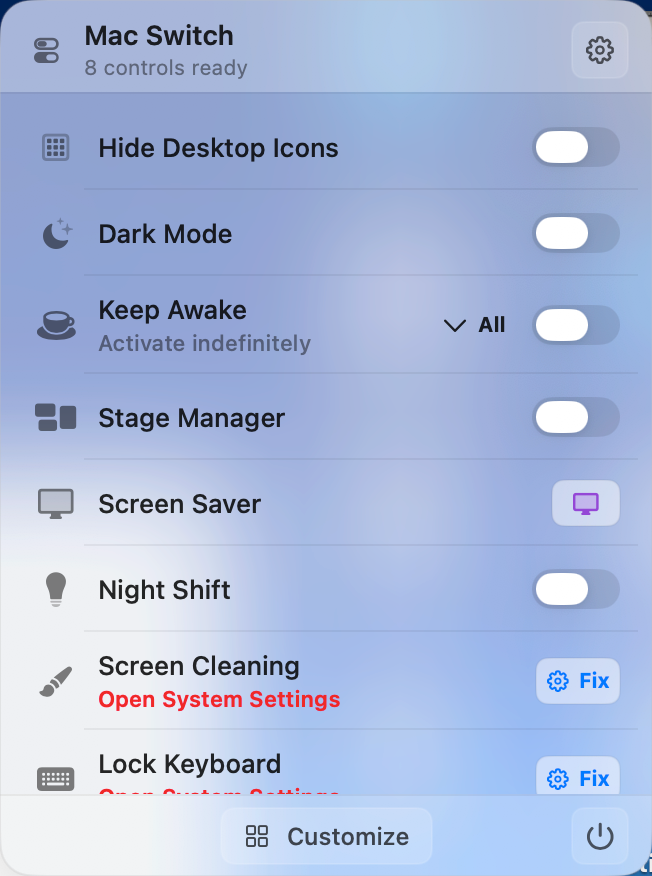
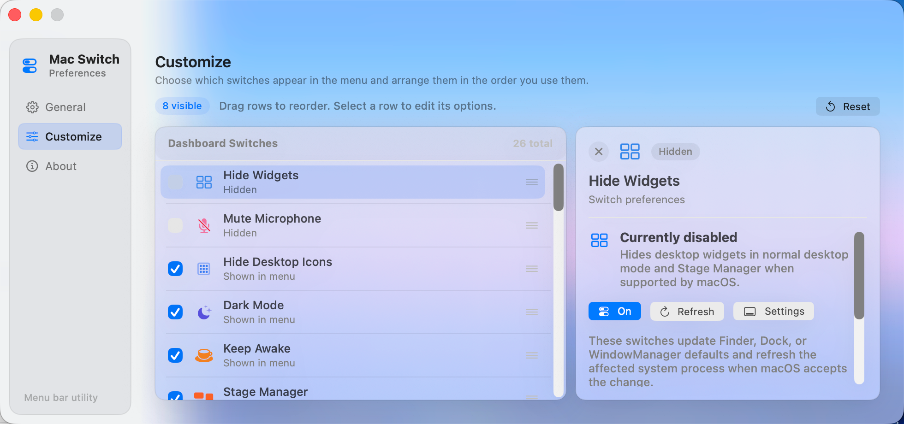

# Mac Switch

Mac Switch is a native macOS menu bar control palette. It ships as a single menu bar app and implements real system actions for:

- Stage Manager
- Hide Widgets
- Mute Microphone
- Hide Desktop Icons
- Dark Mode
- Keep Awake
- Screen Saver
- Bluetooth Audio
- Do Not Disturb
- Night Shift
- True Tone when available on the current display
- Play Music
- Show Hidden Files
- Display Sleep
- Screen Resolution
- Screen Cleaning
- Lock Keyboard
- Lock Screen
- Xcode Cache Clean
- Empty Trash
- Eject Disk
- Empty Pasteboard
- Hide Windows
- Hide Dock
- Low Power Mode
- Energy Mode
- Software Update checks for official builds

Preferences include General, Customize, and About panels. Customize chooses which switches appear in the menu, while visible menu items can be reordered directly from the menu bar dashboard by dragging. Global hot keys are recorded from each switch's options panel.

The source tree contains original implementation code and project-owned app assets. It is published for transparency and review, not as a public build or redistribution guide. Build products, notarization output, local credentials, and developer-machine state are intentionally excluded from version control.

## Screenshots

Menu bar dashboard:

Preferences:

## License

Mac Switch is source-available under the Mac Switch Source Available License
1.0. You may inspect the source for review and personal understanding.
Commercial use, redistribution, binary releases, app-store submissions,
package-manager distribution, publishing forked or rebranded versions, and
operating an update feed require prior written permission from the copyright
holder.
See [LICENSE](LICENSE).

## Official Releases

Official downloads are published through the repository's GitHub Releases and
the in-app update feed. The public source tree is intended to let users inspect
what the app does; it is not permission to publish alternate builds, package
manager releases, app-store submissions, forked editions, or third-party update
feeds.

## Permissions

Dark Mode, Play Music, Empty Trash, and fallback Lock Screen actions use Apple Events to control supported system apps. Lock Keyboard and Screen Cleaning need Accessibility/Input Monitoring permission so the app can install an event tap and suppress keyboard or cleaning-time input. Bluetooth Audio uses Bluetooth to list and connect paired audio devices. Sunrise/sunset Dark Mode scheduling uses Location permission.

## Trademark Notice

Apple, Mac, macOS, Stage Manager, Night Shift, and True Tone are trademarks of
Apple Inc., registered in the U.S. and other countries and regions. Mac Switch
is not affiliated with or endorsed by Apple Inc.
