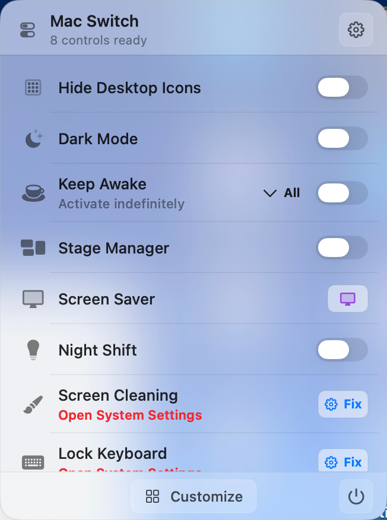
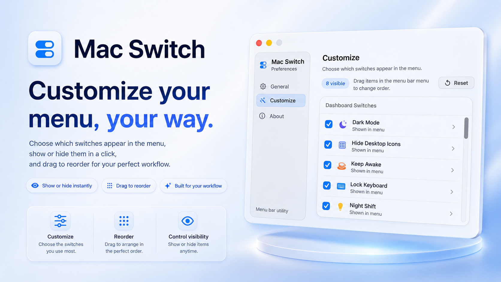

# Mac Switch

## [Download Latest Release](https://github.com/%69%54%76%58/mac-switch/releases/latest)

Download the current notarized Mac Switch build from GitHub Releases.

Mac Switch is a native macOS menu bar utility for the small system controls you reach for every day. Keep the app tucked away in the menu bar, open one compact panel, and toggle common Mac actions without digging through System Settings.

## Highlights

- Fast access to essential Mac toggles from one menu bar panel.
- Real system actions, not placeholder UI.
- Customizable dashboard visibility and drag-to-reorder menu items.
- Lightweight native SwiftUI/AppKit app built for macOS 14 and later.
- Source published for transparency and review, not as a public build or redistribution guide.

## Controls

Mac Switch currently includes:

| Everyday toggles | System utilities |
| --- | --- |
| Keep Awake | Screen Saver |
| Stage Manager | Display Sleep |
| Hide Widgets | Screen Resolution |
| Mute Microphone | Screen Cleaning |
| Hide Desktop Icons | Lock Keyboard |
| Dark Mode | Lock Screen |
| Bluetooth Audio | Xcode Cache Clean |
| Handoff | Empty Trash |
| Do Not Disturb | Eject Disk |
| Night Shift | Empty Pasteboard |
| True Tone, when available | Hide Windows |
| Play Music | |
| Show Hidden Files | |
| Hide Dock | |
| Low Power Mode | |
| Energy Mode | |

Software Update checks are included for official builds distributed through the app's update feed.

## Customize

Choose which switches appear in the menu, hide what you do not use, and drag visible menu items directly in the dashboard to match your workflow. Preferences include General, Customize, and About panels, with per-switch options where a control needs extra setup.

Keep Awake has a timer button directly in its dashboard row. Click it, or right-click the row, to select a duration and toggle **Keep awake when the lid is closed**. The selected duration is marked, and the same settings stay synchronized with Customize. Changing the lid option during a running session preserves its deadline; changing the duration restarts the timer with that duration. Lid-closed operation uses a bundled signed helper. Authorize it once in System Settings > General > Login Items & Extensions; subsequent changes do not prompt for a password. The helper restores the original sleep policy when the session ends, the app disconnects, or a timed session expires. It accepts only the signed Mac Switch app and exposes only the sleep operation.

## Permissions

Mac Switch only asks for macOS permissions needed by the features you use:

- Apple Events: Dark Mode, Play Music, Empty Trash, and fallback Lock Screen actions.
- Accessibility/Input Monitoring: Lock Keyboard and Screen Cleaning event suppression.
- Bluetooth: paired audio device listing and connection.
- Location: sunrise/sunset Dark Mode scheduling.

Do Not Disturb uses two bundled, signed Apple Shortcuts. In Customize > Do Not Disturb, install **Mac Switch DND Enable** and **Mac Switch DND Disable**, then choose **Verify Setup** once with Focus off. Verification briefly enables DND and restores it to off; subsequent actions run in the background. The helpers read Current Focus and explicitly return its name, so state checks do not depend on shared Focus Status. Opening the dashboard shows the last confirmed DND state without executing a shortcut. Toggle preflight, Mode activation, and restoration use fresh observations, including when DND was already on. Other active Focus modes are left unchanged. Reinstalling or renaming the helpers requires setup again. Legacy custom DND shortcuts are no longer used.

## Official Releases

Official downloads are published through the repository's GitHub Releases and the in-app update feed. The public source tree is intended to let users inspect what the app does; it is not permission to publish alternate builds, package-manager releases, app-store submissions, forked editions, or third-party update feeds.

## License

Mac Switch is source-available under the Mac Switch Source Available License 1.0. You may inspect the source for review and personal understanding. Commercial use, redistribution, binary releases, app-store submissions, package-manager distribution, publishing forked or rebranded versions, and operating an update feed require prior written permission from the copyright holder.

See [LICENSE](LICENSE).

## Trademark Notice

Apple, Mac, macOS, Stage Manager, Night Shift, and True Tone are trademarks of Apple Inc., registered in the U.S. and other countries and regions. Mac Switch is not affiliated with or endorsed by Apple Inc.
